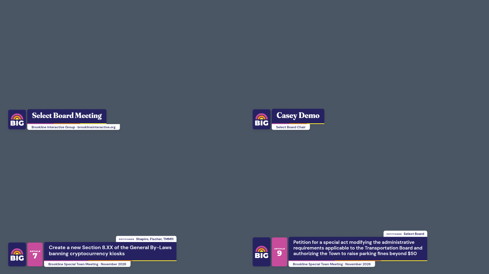

# Community Titler

**Animated lower thirds with real transparency — built for community media stations.**

Type your titles in (or import a whole spreadsheet), pick a look, and export broadcast-ready graphics with alpha channels for OBS, vMix, CasparCG, your NLE, or a key/fill DeckLink output into a video switcher.

Made by [Brookline Interactive Group](https://brooklineinteractive.org) for every community access station. Free, open source (MIT). Runs as a **desktop app (Windows + macOS)**, in your **browser**, or from the **command line** — and nothing is ever uploaded anywhere.


## Get it

| | |
|---|---|
| **Windows** | [`Community-Titler-<version>-win-setup.exe`](https://github.com/amateurmenace/community-titler/releases/latest) (installer) or the `-win-portable.exe` (no install) |
| **macOS, Apple silicon** | [`Community-Titler-<version>-mac-arm64.dmg`](https://github.com/amateurmenace/community-titler/releases/latest) |
| **macOS, Intel** | [`Community-Titler-<version>-mac-x64.dmg`](https://github.com/amateurmenace/community-titler/releases/latest) |
| **Browser (no install)** | **https://amateurmenace.github.io/community-titler/** |

The desktop app bundles its own ffmpeg, so ProRes and WebM exports take seconds per title instead of the browser's slower in-page encoder.

> **First launch on macOS:** the app is not notarized, so macOS will say it “cannot be opened”. Right-click the app → **Open** → **Open** once (on macOS 15+: System Settings → Privacy & Security → **Open Anyway**). On Windows, SmartScreen may ask you to click **More info → Run anyway**.

## What it makes

Three kinds of lower thirds. Each one *builds* on screen — the station tile pops in, the arches draw on, the name bar extends out of the tile, your **website** rises out of the top-left on a tab, the name wipes in, the brand stripe draws, and the role bar slides out underneath — then holds, then reverses out. They sit low and left (64 px in, 56 px up at 1080p — inside action-safe, not title-safe) and never run past 75% of the frame width, so the lower-right stays clear for closed captions.

| Type | For | Example |
|---|---|---|
| **Speaker** | Who's talking — name + role | *Jordan Example · Town Moderator* |
| **Show ID** | Opening a program — title + your station line | *Brookline Special Town Meeting 2026 · Brookline Interactive Group* |
| **Article** | Dense info cards — number badge + full article title + meeting tag, with the **petitioner** on a tab above the title's right end. Long titles switch to a **Large** layout on their own: bigger type on up to four lines, never wider than the look's **Max width** (75% of the frame by default) | *Article 7 · Create a new Section 8.XX of the General By-Laws banning cryptocurrency kiosks · Petitioner: Shapiro, Fischer, TMM11* |

Every title carries the station's **website** on a small tab jutting out of the top-left corner, in the tile's own colour (set it under Station identity in the Look step, or turn the tab off there and the website goes on the show ID's second line instead). Any title can also carry the **date**, typed once for the whole project: it continues the tag or role line after a dot — *Brookline Special Town Meeting · November 17, 2026* — replacing a month, year or date the line already ends with. Leave it blank and the line ends in an empty slot that a text source in OBS can fill with the live date (see [A live date from OBS](#a-live-date-from-obs)). Press <kbd>Enter</kbd> while typing a title to break a line where you want it.



## Three steps

1. **Titles** — add speakers, show IDs and articles one at a time, or **Import spreadsheet** (CSV, Excel, or paste straight from Google Sheets). Click any title to preview and edit it; <kbd>Enter</kbd> starts a new line. Articles have a **Petitioner** field (the tab above the title). Each title has a **Size on screen** (Auto / Standard / Large) and a text-size nudge; Auto goes Large whenever a title would otherwise come out small. **Date on every title** lives at the top of the list.
2. **Look** — the gallery sits under the preview; every adjustment is in the left column so the video stays in view while you drag: **Placement & size** (max width, scale, bar height, left and bottom margins, corners, position — each slider steps by 1 and has a box beside it to type the exact number), **Type** (fonts, weights and sizes for names, article titles, sub bar and tabs, tile mark, badge), **Colors**, **Station identity** (name, mark, logo, website tab) and **Motion & extras**. The first change makes the look your own copy; the built-in stays as it is.
3. **Export** — choose a format, timing and a folder, tick the titles you want, and **Export**. Press <kbd>Space</kbd> anywhere to play the preview.

Projects auto-save in the app; **Project → Save project file** writes a portable `.titler.json` you can archive or move between machines.

### Regenerating the Brookline town meeting titles

The app ships with the full warrant for the **Brookline Special Town Meeting (November 2026)** — the show ID plus all 21 articles. To regenerate the set at any time:

1. **Project → Load Brookline Town Meeting 2026** (the sample replaces the title list and sets the date to November 17, 2026; your look and export settings stay).
2. Make sure the look is **BIG — Brookline Interactive**.
3. **Export → Export all 22 titles.**

The petitioner in each article's trailing parenthesis — *(Select Board)*, *(Gordon, TMM1, Friedman, TMM12)* — becomes the tab above the title. The longest articles (6 and 11) render in the **Large** layout automatically so they read on a TV; switch any title between Standard and Large in the Titles step. Files are named by article number — `Article-07_Create-a-new-Section-8-XX….mov` — so the folder lines up with the warrant, and the show ID is `Show_Brookline-Special-Town-Meeting-2026.mov`.

The same list is in [`public/samples/brookline-stm-2026-warrant-articles.csv`](public/samples/brookline-stm-2026-warrant-articles.csv) for the CLI (`npm run render -- --sample`). When the next warrant is posted, paste the article list into a sheet and import it — rows like `5. Resolution regarding… (Petitioner)` are split into badge, title and petitioner automatically.

## Bulk titles from a spreadsheet

1. Put your titles in Google Sheets, Excel, or any CSV with columns:

   | type | badge | primary | secondary | petitioner |
   |---|---|---|---|---|
   | `show` | | Brookline Special Town Meeting 2026 | *(blank = station name + URL)* | |
   | `speaker` | | Jordan Example | Town Moderator | |
   | `article` | Article 5 | Resolution urging the Select Board… | Special Town Meeting · November 2026 | Anderson, Bassett, TMM6 |

2. **Titles → Import spreadsheet** → drop the `.csv`/`.xlsx`, or paste the cells.
3. **Export.**

Header names are flexible (`name`, `title`, `number`, `role`, `sponsor`… are all recognized), plain numbers become “Article N”, a sheet with just two columns is read as name + role, and without a petitioner column an article's trailing *(…)* is used. A line break inside a cell becomes a line break on screen. Sample files live in [`public/samples/`](public/samples/).

## Exporting alpha for OBS and key/fill

Every format carries a real alpha channel:

- **ProRes 4444 (.mov)** — the broadcast workhorse. Big files, flawless alpha, decodes effortlessly in OBS. **Recommended for key/fill playout.**
- **WebM (.webm)** — small files, great for OBS overlay scenes.
- **PNG still (.png)** — one transparent frame per title, instantly.
- **PNG sequence** — every frame as numbered PNGs (a folder from the desktop app, a `.zip` from the browser) for NLEs and CasparCG.

Timing defaults to a 1.1 s build, a 6 s hold and a 0.9 s out. For a key/fill feed you cut away from by hand, make the hold long.

**File names.** Articles are named by their number (`Article-07_Create-a-new-Section….mov`), speakers and show IDs by what they say (`Speaker_Jordan-Example.mov`, `Show_Select-Board-Meeting.mov`). Two titles that would get the same name are suffixed `-2`, `-3`.

### A live date from OBS

Turn **Date on every title** on and leave the text blank. Every title's tag line then ends in a dot and an empty slot (x, y and size are printed above the preview), and the Titles step offers **Download the OBS date overlay**: a small HTML file that prints today's date in that slot in the look's own type and colours and refreshes itself at midnight.

1. In OBS: **Sources → + → Browser** → tick **Local file** → pick the downloaded `obs-date-overlay-….html` → width 1920, height 1080 (or your export size). Keep it above the title sources.
2. That's it: the bar comes from the title clip, the date from the overlay. To change the wording (weekday, short month…) edit the `FORMAT` line inside the file. The overlay is measured on the first article, so titles whose tag line reads differently (a speaker's role, say) put the slot somewhere else; keep one tag per meeting.

Prefer a Text source? [K_STYER's Dynamic Time and Date Display](https://obsproject.com/forum/resources/k_styers-dynamic-time-and-date-display-for-obs-en-multi-8.1946/) on the OBS forum (**Tools → Scripts**) keeps a *Text (GDI+)* source showing the date; place it in the slot.

## Looks & making it yours

Five built-in looks: **BIG — Brookline Interactive** (navy tiles, the rainbow arches over a big Montserrat **BIG**, tri-color stripe, Fraunces serif names), **Civic Green** (the [Community AI Project](https://github.com/amateurmenace/community-ai-project) palette — forest green, lime, cream), neutral **Broadcast Slate**, civic **Town Hall**, and **Minimal Light**.

To rebrand for your station: in **Look**, start changing things — the first edit turns the built-in into your own copy, saved with the project. Set your station name, short mark and website (it rides on the tab at the top-left of every title), upload a **logo PNG** for the tile, pick fonts and weights (Fraunces, DM Sans, Inter, JetBrains Mono and Montserrat are bundled; add your own `.ttf`), set the **type sizes** (name / show title, article title, sub bar and tabs, tile mark, badge — each a percentage of the look's default), move the titles with the **margin** and **max width** sliders, set every color, and choose the motion. **Export** the look as a `.theme.json` to share with your team — or open a PR to add your station's look as a built-in.

## CLI batch rendering

If you have [ffmpeg](https://ffmpeg.org) on your PATH, the CLI renders the same pixels as the app:

```bash
npm run render -- --csv mytitles.csv --format prores --out exports/tonight
```

```bash
npm run render -- --sample --format webm --theme big --hold 8
```

Formats: `prores`, `webm`, `png`, `pngseq`. Run `npm run render -- --help` for every flag (`--theme your-station.theme.json`, `--size 1280x720`, `--fps 59.94`, `--only 3,5`, `--date "November 17, 2026"`, `--date ""` for the blank OBS slot, …). `node scripts/measure.mjs --sample` prints each title's type size, line count, right edge and height without rendering — handy when adjusting a look.

## For developers

```bash
git clone https://github.com/amateurmenace/community-titler.git
cd community-titler
npm install
npm run dev        # web app at http://localhost:5173
npm run app        # the desktop app, hot-reloading against the dev server
npm run dist:win   # Windows installer + portable exe  → release/
npm run dist:mac   # macOS dmg + zip (run on a Mac)     → release/
```

- Vite + React + TypeScript. The drawing lives in [`src/renderer/core.js`](src/renderer/core.js) — a pure, dependency-free canvas renderer used identically by the preview, the desktop and in-browser exporters, and the Node CLI, so what you preview is exactly what exports. Looks are plain data in [`src/renderer/themes.js`](src/renderer/themes.js).
- The app chrome follows the Community AI Project's **Civic UI** design system (cream canvas, deep green, lime, hard offset shadows, Inter + JetBrains Mono) — tokens in [`src/styles.css`](src/styles.css).
- The desktop shell is [`electron/main.cjs`](electron/main.cjs) + [`electron/preload.cjs`](electron/preload.cjs); it streams raw frames into a bundled ffmpeg (`ffmpeg-static`). The browser build encodes with ffmpeg.wasm (single-threaded core, served same-origin — works offline and on GitHub Pages).
- **Releasing:** bump `version` in `package.json`, then push a tag — `git tag v2.0.1 && git push --tags`. The [`Build desktop apps`](.github/workflows/release.yml) workflow builds the Windows installer and both macOS apps and attaches them to the GitHub Release. Pushes to `main` deploy the web app to GitHub Pages.

PRs welcome — new looks, new title layouts, translations, CasparCG/HTML output, whatever your station needs.

## License

MIT. Bundled fonts — [Fraunces](https://github.com/undercasetype/Fraunces), [DM Sans](https://github.com/googlefonts/dm-fonts), [Inter](https://github.com/rsms/inter), [JetBrains Mono](https://github.com/JetBrains/JetBrainsMono) and [Montserrat](https://github.com/JulietaUla/Montserrat) — are SIL OFL 1.1 (licenses in `public/fonts/`). The BIG look is included with Brookline Interactive Group's blessing; your station's logo and branding remain, of course, your own.
